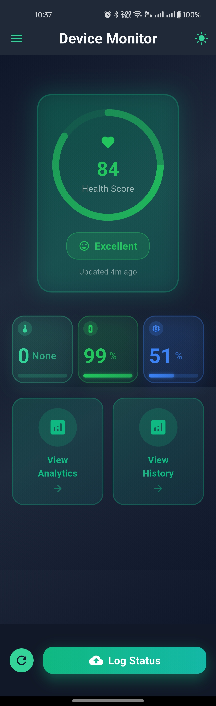
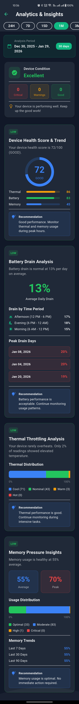
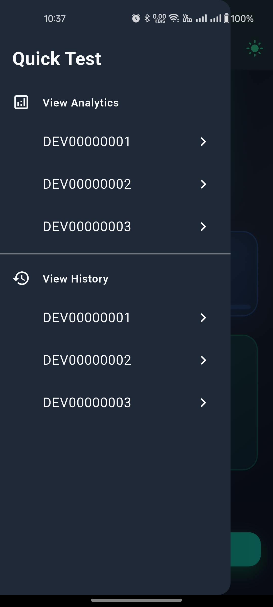
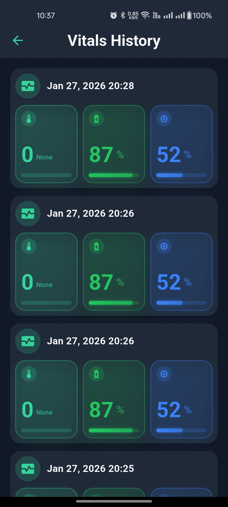
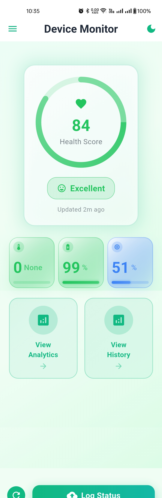
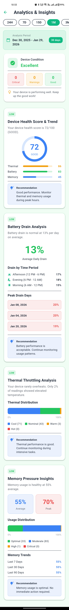
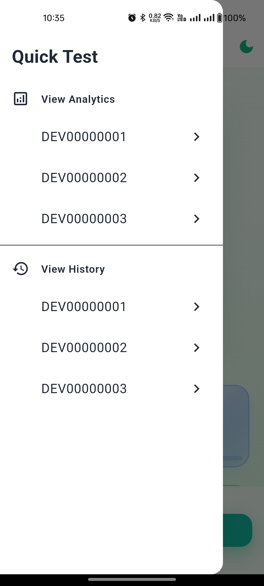
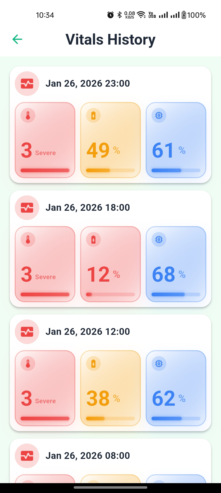

# Device Monitor - Device Health Tracking System

A comprehensive mobile and backend solution for monitoring and analyzing device health metrics
including thermal state, battery level, and memory usage. The system provides real-time data
collection, historical analysis, and intelligent insights to help users maintain optimal device
performance.

Built with Flutter for cross-platform mobile development and Spring Boot for a robust, scalable
backend infrastructure with PostgreSQL database, deployed on a production server with Docker
containerization.

---

## 🎯 Project Goals

- ✅ **Real-time Monitoring**: Capture device vitals (thermal, battery, memory) using native platform
  APIs
- ✅ **Data Persistence**: Store historical device metrics with RESTful API backend
- ✅ **Intelligent Analytics**: Provide actionable insights through data analysis and trend detection
- ✅ **User-friendly Interface**: Deliver intuitive UI/UX with light/dark theme support
- ✅ **Performance Tracking**: Monitor device health score and identify performance bottlenecks
- ✅ **Production Ready**: Implement industry-standard architecture with proper testing and
  deployment

---

## 📂 Project Structure

```
ac79aefd97a4/
│
├── device_monitor_backend/              # Spring Boot Backend API
│   ├── src/
│   │   ├── main/
│   │   │   ├── java/com/devicemonitor/src
│   │   │   │   ├── config/              # Configuration classes
│   │   │   │   ├── core/                # Core/shared modules
│   │   │   │   │   ├── base/            # Base classes
│   │   │   │   │   └── utils/           # Utility classes
│   │   │   │   │
│   │   │   │   └── features/            # Feature modules
│   │   │   │       ├── vitals/          # Vitals feature
│   │   │   │       │   ├── controllers/
│   │   │   │       │   ├── services/
│   │   │   │       │   └── data/
│   │   │   │       │       ├── repository/
│   │   │   │       │       ├── entities/
│   │   │   │       │       └── dto/     # Data Transfer Objects
│   │   │   │       │
│   │   │   │       ├── analytics/       # Analytics feature
│   │   │   │       │   ├── controllers/
│   │   │   │       │   ├── services/
│   │   │   │       │   └── data/
│   │   │   │       │       ├── repository/
│   │   │   │       │       ├── entities/
│   │   │   │       │       └── dto/
│   │   │   │       │
│   │   │   │       └── device/          # Device feature
│   │   │   │           ├── controllers/
│   │   │   │           ├── services/
│   │   │   │           └── data/
│   │   │   │               ├── repository/
│   │   │   │               ├── entities/
│   │   │   │               └── dto/
│   │   │   │
│   │   │   └── resources/               # Configuration files
│   │   │
│   │   └── test/                        # Backend tests
│   │
│   ├── docker-compose.yml
│   ├── Dockerfile
│   └── .env
│
│
├── device_monitor_flutter_app/          # Flutter Mobile Application
│   ├── lib/
│   │   ├── src/
│   │   │   ├── core/                    # Core utilities, themes, constants
│   │   │   │   ├── config/              # Configuration
│   │   │   │   ├── data/                # Core data layer
│   │   │   │   │   ├── models/
│   │   │   │   │   └── repositories/
│   │   │   │   ├── domain/              # Core domain layer
│   │   │   │   │   └── interfaces/
│   │   │   │   ├── services/            # Core services
│   │   │   │   ├── theme/               # Theme configuration
│   │   │   │   └── utils/               # Core utilities
│   │   │   │       ├── constants/
│   │   │   │       └── helpers/
│   │   │   │
│   │   │   └── features/                # Feature modules
│   │   │       ├── vitals/              # Vitals feature module
│   │   │       │   ├── data/            # Data layer
│   │   │       │   │   ├── repositories/
│   │   │       │   │   ├── models/
│   │   │       │   │   ├── requests/
│   │   │       │   │   └── responses/
│   │   │       │   │
│   │   │       │   ├── domain/          # Domain layer
│   │   │       │   │   ├── interfaces/
│   │   │       │   │   ├── usecases/
│   │   │       │   │   └── entities/
│   │   │       │   │
│   │   │       │   └── presentation/    # Presentation layer
│   │   │       │       ├── screens/
│   │   │       │       ├── providers/
│   │   │       │       └── widgets/
│   │   │       │
│   │   │       ├── analytics/           # Analytics feature module
│   │   │       │   ├── data/
│   │   │       │   │   ├── repositories/
│   │   │       │   │   ├── models/
│   │   │       │   │   ├── requests/
│   │   │       │   │   └── responses/
│   │   │       │   ├── domain/
│   │   │       │   │   ├── interfaces/
│   │   │       │   │   ├── usecases/
│   │   │       │   │   └── entities/
│   │   │       │   └── presentation/
│   │   │       │       ├── screens/
│   │   │       │       ├── providers/
│   │   │       │       └── widgets/
│   │   │       │
│   │   │       ├── history/             # History feature module
│   │   │       │   ├── data/
│   │   │       │   │   ├── repositories/
│   │   │       │   │   ├── models/
│   │   │       │   │   ├── requests/
│   │   │       │   │   └── responses/
│   │   │       │   ├── domain/
│   │   │       │   │   ├── interfaces/
│   │   │       │   │   ├── usecases/
│   │   │       │   │   └── entities/
│   │   │       │   └── presentation/
│   │   │       │       ├── screens/
│   │   │       │       ├── providers/
│   │   │       │       └── widgets/
│   │   │       │
│   │   │       ├── device/              # Device feature module
│   │   │       │   ├── data/
│   │   │       │   │   ├── repositories/
│   │   │       │   │   ├── models/
│   │   │       │   │   ├── requests/
│   │   │       │   │   └── responses/
│   │   │       │   ├── domain/
│   │   │       │   │   ├── interfaces/
│   │   │       │   │   ├── usecases/
│   │   │       │   │   └── entities/
│   │   │       │   └── presentation/
│   │   │       │       ├── screens/
│   │   │       │       ├── providers/
│   │   │       │       └── widgets/
│   │   │       │
│   │   │       └── common/              # Common/shared features
│   │   │           └── presentation/
│   │   │               ├── screens/
│   │   │               ├── providers/
│   │   │               └── widgets/
│   │   │
│   │   └── main.dart
│   │
│   ├── android/                         # Android native code
│   │   └── app/
│   │       └── src/
│   │           └── main/
│   │               └── kotlin/com/devicemonitor/
│   │
│   ├── test/                            # Unit tests
│   │   ├── unit/
│   │   │   ├── core/
│   │   │   │   ├── services/
│   │   │   │   └── utils/
│   │   │   │
│   │   │   └── features/
│   │   │       ├── vitals/
│   │   │           ├── data/
│   │   │           │   └── mocck_repositories/
│   │   │           ├── domain/
│   │   │               └── mock_usecases/
│   ├── integration/                # Integration tests
│   │   ├── core/di                 # Test Dependency Injection
│   │   │
│   │   └── features/
│   │       ├── vitals/
│   │
│   ├── assets/                          # Static assets
│   │   └── icons/
│   │
│   └── pubspec.yaml
│
│
└── documentation/                       # Project documentation
    ├── dark_mode_ss/                    # Dark theme screenshots
    └── light_mode_ss/                   # Light theme screenshots
```
---

## 🛠️ Tech Stack

### **Mobile Application**

- **Framework**: Flutter 3.x
- **Language**: Dart
- **State Management**: Provider
- **Native Integration**: MethodChannel (Android - Kotlin)
- **HTTP Client**: http package
- **Testing**: flutter_test, test, mocktail

### **Backend API**

- **Framework**: Spring Boot 2.6.4
- **Language**: Java 17
- **Database**: PostgreSQL
- **Containerization**: Docker & Docker Compose
- **ORM**: Spring Data JPA
- **Security**: Environment-based configuration (.env)
- **Deployment**: Production server (deployed)

---

## 📱 Flutter App Setup & Running Instructions

### **Prerequisites**

- Flutter SDK 3.x or higher ([Install Flutter](https://docs.flutter.dev/get-started/install))
- Android Studio / Xcode (for device emulator)
- Git
- Android SDK (API 21+) for Android development

### **Installation Steps**

1. **Clone the repository**
   ```bash
   git clone https://github.com/imsisojib-dev/ac79aefd97a4.git
   cd ac79aefd97a4/device_monitor_flutter_app
   ```

2. **Install dependencies**
   ```bash
   flutter pub get
   ```

3**Run the app**

   ```bash
   # Check connected devices
   flutter devices
   
   # Run on connected device/emulator
   flutter run
   
   # Or run in release mode
   flutter run --release
   ```

4**Build APK (Android)**

   ```bash
   flutter build apk --release
   # Output: build/app/outputs/flutter-apk/app-release.apk
   ```

### **Running Tests**

```bash
# Unit tests
flutter test

# Integration tests
flutter test integration_test/

# With coverage
flutter test --coverage
```

---

## 🖥️ Spring Boot Backend Setup & Running Instructions

### **Prerequisites**

- Java 17
- Docker & Docker Compose ([Install Docker](https://docs.docker.com/get-docker/))
- PostgreSQL 15 (if running without Docker)
- Maven 3.8+

### **Installation Steps**

1. **Navigate to backend directory**
   ```bash
   cd ac79aefd97a4/device_monitor_backend
   ```

2. **Configure environment variables**

   Create `.env` file in the root directory:
   ```env
    APP_NAME=DeviceMonitor
    APP_SECRET=imsisojib
    APP_PORT=8088
    
    POSTGRES_DB_SERVER_ADDRESS= //add db server address
    POSTGRES_DB_SERVER_PORT= // add db port address
    POSTGRES_USER= //add db user
    POSTGRES_PASSWORD= // add db password
    
    X_API_KEY = DEVICEMONITOR3D4E5F6G7H8I9J0K1L2M3N4O5P6
    X_SERVICE_NAME = device-monitor
   ```

3. **Run with Docker (Recommended)**
   ```bash
   # Build and start all services
   docker-compose up -d
   
   # View logs
   docker-compose logs -f
   
   # Stop services
   docker-compose down
   ```

4. **Run without Docker**
   ```bash
   # Ensure PostgreSQL is running locally
   
   # Using Maven
   ./mvnw clean install
   ./mvnw spring-boot:run
   
   # Using Gradle
   ./gradlew clean build
   ./gradlew bootRun
   ```

5. **Verify API is running**
   ```bash
   curl http://localhost:8088/device_monitor/api/devices
   # Expected: list of devices data
   ```

### **API Documentation**

Once running, access Swagger UI at: `http://localhost:8088/device_monitorswagger-ui.html`

---

## ✨ Implemented Features

### **Mobile Application Features**

#### **1. Native Platform Integration**

- ✅ **MethodChannel Implementation** (Android - Kotlin)
    - Thermal status monitoring using `PowerManager` API
    - Battery level tracking using `BatteryManager`
    - Memory usage calculation using `ActivityManager`
    - No third-party plugins for sensor data (custom implementation)

#### **2. Home Screen (Dashboard)**

- ✅ Real-time vitals display with visual indicators
- ✅ Health score calculation (0-100 based on thermal, battery, memory)
- ✅ Animated health status with pulse effect
- ✅ Modern card-based UI with gradient backgrounds
- ✅ Manual refresh functionality
- ✅ "Log Status" button to save vitals to backend
- ✅ Success/error feedback with Dialog view
- ✅ Light/Dark theme toggle

#### **3. History Screen**

- ✅ Chronological list of all logged vitals
- ✅ Grouped display with date formatting
- ✅ Visual chips for thermal, battery, and memory values
- ✅ Pull-to-refresh functionality
- ✅ Empty state handling

#### **4. Analytics Screen**

- ✅ **Date Range Selector** (24H, 7D, 15D, 1M, 3M, 6M, 1Y)
- ✅ **Device Health Score & Trend**
    - Current score with status (Excellent/Good/Fair/Poor)
    - Breakdown by thermal, battery, and memory scores
    - Trend percentage (improving/declining/stable)
    - Circular progress indicator visualization

- ✅ **Battery Drain Analysis**
    - Average daily drain percentage
    - Time period breakdown (Morning/Afternoon/Evening)
    - Peak drain days with dates and reasons
    - Color-coded severity indicators

- ✅ **Thermal Throttling Alerts**
    - Thermal distribution chart (Cool/Nominal/Warm/Hot)
    - Critical thermal events timeline
    - Event impact details
    - Horizontal stacked bar visualization

- ✅ **Memory Pressure Insights**
    - Average and peak memory usage statistics
    - Usage distribution chart (Optimal/Moderate/High/Critical)
    - Memory trends (7/30/90 days)
    - Pressure level indicators

#### **5. Additional Features**

- ✅ Splash screen with animated logo
- ✅ State management with Provider
- ✅ Error handling and retry mechanisms
- ✅ Network connectivity checks
- ✅ Background task support (WorkManager integration)
- ✅ Device ID generation and persistence

---

### **Backend API Features**

#### **1. Infrastructure**

- ✅ **Docker Containerization**
    - Docker Compose for orchestration
    - Environment variable configuration
    - Production-ready deployment

- ✅ **PostgreSQL Database**
    - Relational database with proper schema design
    - Indexed columns for performance
    - Data persistence with volume mounting
    - Connection pooling

- ✅ **Environment Configuration**
    - `.env` file for sensitive data
    - Profile-based configuration (dev/prod)
    - Externalized configuration management

#### **2. REST API Endpoints**

##### **Vitals Management**

- ✅ `POST /api/vitals` - Create new vital log
    - Request validation (thermal: 0-3, battery: 0-100, memory: 0-100)
    - Timestamp validation (reject future dates)
    - Device ID association

- ✅ `POST /api/vitals/${deviceId}` - Retrieve vital logs with Filter option passes to body
    - Pagination support
    - Filtering by device ID
    - Sorting by timestamp (newest first)

##### **Device Management**

- ✅ `POST /api/devices` - Register new device
    - Unique device ID generation
    - Device metadata storage

- ✅ `POST /api/devices/list` - List all devices with filtering option
    - Device information retrieval
    - Registration timestamp

##### **Analytics Engine**

- ✅ `GET /api/analysis/${deviceId}` - Comprehensive analytics
    - **Device Health Score**: Calculated from thermal, battery, memory metrics
    - **Battery Drain Analysis**: Daily patterns, peak usage, time-based insights
    - **Thermal Throttling Alerts**: Distribution analysis, critical events
    - **Memory Pressure Insights**: Usage trends, pressure percentages, distributions
    - Date range filtering (1D to 1Y)
    - Rolling average calculations
    - Statistical aggregations (min, max, average)

#### **3. Data Processing**

- ✅ Input validation with proper error responses
- ✅ Data sanitization and type checking
- ✅ Business logic separation (Service layer)
- ✅ Repository pattern for data access
- ✅ DTO (Data Transfer Objects) for API contracts
- ✅ Entity mapping with JPA

#### **4. Production Deployment**

- ✅ Deployed to production server
- ✅ HTTP support
- ✅ CORS configuration for mobile app
- ✅ Logging and monitoring
- ✅ Error handling middleware

---

## 📸 Project Overview

### **Screenshots**

#### **Dark Mode**

<div align="center">
  
  
  
  
</div>

#### **Light Mode**

<div align="center">
  
  
  
  
</div>

### **Key UI Highlights**

- 🎨 Modern Material Design 3 interface
- 🌓 Seamless light/dark theme switching
- 📊 Interactive data visualizations
- 💚 Green-based color palette for health monitoring
- ⚡ Smooth animations and transitions
- 📱 Responsive layouts for all screen sizes

---

## 🧪 Testing

### **Flutter App Testing**

#### **Unit Tests**

- ✅ **UseCaseSaveVitals** - Complete test coverage
    - Success scenarios
    - Validation errors (400, invalid ranges)
    - Server errors (500, network failures)
    - Null handling (null data)
    - Exception handling
    - **Coverage**: 100% for use case logic

#### **Integration Tests**

- ✅ **UseCaseSaveVitals Integration**
    - Full stack testing (UseCase → Repository → API)
    - Real network requests
    - Validation error handling
    - Network timeout scenarios
    - Edge case values (min/max boundaries)
    - Performance testing

#### **Test Execution**

```bash
# Run all tests
flutter test

# Generate coverage report
flutter test --coverage
genhtml coverage/lcov.info -o coverage/html
```

#### **Test Results**

- ✅ All unit tests passing
- ✅ Integration tests verified with real API
- ✅ Code coverage >80% for critical paths
- ✅ No flaky tests detected

---

## 🚀 Future Work & Enhancements

### **Backend Testing**

- 🔄 Implement unit tests for service layer
- 🔄 Integration tests for API endpoints
- 🔄 Database integration tests
- 🔄 Load testing and performance benchmarks
- 🔄 Security testing (input validation, SQL injection)
- 🔄 CI/CD pipeline with automated testing

### **Real-time Features**

- 🔄 WebSocket implementation for live data updates
- 🔄 Real-time dashboard with auto-refresh
- 🔄 Push notifications for critical alerts
- 🔄 Live thermal/battery monitoring without manual refresh
- 🔄 Multi-device synchronization
- 🔄 Real-time collaboration features

### **Additional Features**

- 🔄 User authentication and authorization
- 🔄 Export analytics to PDF/CSV
- 🔄 Custom alert thresholds
- 🔄 Machine learning predictions
- 🔄 iOS platform support (currently Android only)
- 🔄 Offline mode with local caching
- 🔄 Advanced filtering and search
- 🔄 Widget support for home screen

---

---

## 👨‍💻 Author

**Developer**: Md Sirajul Islam Sojib 
**Repository**: [ac79aefd97a4](https://github.com/imsisojib-dev/ac79aefd97a4)

---

## 📞 Contact & Support

For technical questions or issues:

- Create an issue in the repository
- Contact via email: [imsisojib@gmail.com]

---

**Built with ❤️ using Flutter & Spring Boot**